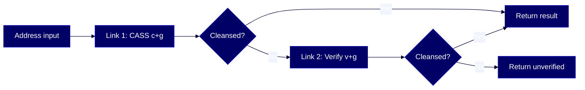

# HOWTO: Configure chain cleansing

Set up a chain of address cleanse functions in your tenant configuration so that addresses are validated through multiple cleansing methods in sequence — getting the best possible cleansed result even when the first method fails.



## Overview

This guide explains how to configure [chain cleansing](#glossary) in the Reltio Context Intelligence Platform. Chain cleansing lets you define a sequence of address cleanse functions in the `cleanseConfig` section of your tenant configuration, so that if one method fails, the next one in the chain takes over. This is especially useful when you need to validate addresses from multiple countries using different cleansing methods.

This guide is for these Reltio roles: **Reltio Configurator**, **Solution Architect**. For more information on data unification roles in the Reltio Context Intelligence Platform, see [About roles](https://docs.reltio.com/en/roles/about-roles).

## Contents

1. [Getting started](#1-getting-started)
2. [Key concepts](#2-key-concepts)
3. [Understand how chain cleansing works](#3-understand-how-chain-cleansing-works)
4. [Define the chain in the meta-configuration](#4-define-the-chain-in-the-meta-configuration)
5. [Configure chain link parameters](#5-configure-chain-link-parameters)
6. [Set proceed-on-success and proceed-on-failure](#6-set-proceed-on-success-and-proceed-on-failure)
7. [Add mandatory fields to the output mapping](#7-add-mandatory-fields-to-the-output-mapping)
8. [Configure chain cleansing for AddressInput](#8-configure-chain-cleansing-for-addressinput)
9. [Troubleshooting](#9-troubleshooting)
10. [Further reading](#10-further-reading)
11. [Glossary](#11-glossary)

## 1. Getting started

Before you begin, confirm the following are in place:

- Address cleansing is enabled for your tenant. If you need [CASS](#glossary) and/or [SERP](#glossary) cleansing, open a Reltio Support ticket to enable them for your Data Cleanse plugin.
- You have access to your tenant's [L3 configuration](#glossary) (the business-level data model that includes entity types, attributes, and cleanse settings).
- You have a `Location` entity type (or equivalent) with address attributes configured for cleansing.
- You understand the `process` key options available for address cleansing:

| Process | Description |
|---|---|
| `c+g` | CASS processes US addresses only. Non-US addresses are returned without an [AVC](#glossary) |
| `serp+g` | SERP processes Canada addresses only. Non-Canada addresses are returned without AVC |
| `v+g` | Processes addresses of all countries |
| `serp+c+v+g` | Verifies Canadian (SERP), US (CASS), and other countries (Verify) |
| `serp+c+g` | Processes Canadian (SERP) and US (CASS) only; other countries aren't cleansed |

> **Learn more:** [Configuring Tenant](https://docs.reltio.com/en/objectives/cleanse-and-verify-data/data-cleansing-at-a-glance/data-cleansing-reference/out-of-the-box-cleanse-functions/address-cleanser/configuring-tenant) in the Reltio documentation.

## 2. Key concepts

**[Chain cleansing](#glossary)** is a configuration pattern where the `chain` section of `cleanseConfig` specifies a list of cleanse functions that are applied one by one in sequence. Each function in the chain is called a **link**. The chain logic uses two control flags — `proceedOnSuccess` and `proceedOnFailure` — to determine whether the next link runs after the current one completes.

The primary use case is validating addresses from multiple countries. For example, if you need to handle both US and non-US addresses, you can set up:

- **Link 1** — CASS cleansing (`c+g`) for US addresses.
- **Link 2** — Standard verification (`v+g`) as a fallback for non-US addresses that CASS can't process.

The [Address Verification Code (AVC)](#glossary) plays a critical role in chain cleansing. Without AVC, the system can't reliably determine whether a cleanse result is valid. To avoid accepting failed results, you set mandatory fields in the output mapping — particularly the `AVC` attribute — so that incomplete results are filtered out.

> **Learn more:** [Address cleanser](https://docs.reltio.com/en/objectives/cleanse-and-verify-data/data-cleansing-at-a-glance/data-cleansing-reference/out-of-the-box-cleanse-functions/address-cleanser) in the Reltio documentation.

## 3. Understand how chain cleansing works

A chain processes each link in order. After each link runs, Reltio checks whether it succeeded or failed, then looks at the control flags to decide what happens next:

- `proceedOnSuccess` — if `true`, the next link runs even when the current link succeeds. If `false`, the chain stops on success.
- `proceedOnFailure` — if `true`, the next link runs when the current link fails. If `false`, the chain stops on failure.

For the common CASS-then-Verify pattern, configure the first link like this:

- `"proceedOnSuccess": false` — if CASS succeeds, stop and use that result.
- `"proceedOnFailure": true` — if CASS fails (non-US address), proceed to the next link.

The second link then applies standard verification (`v+g`) to handle the address that CASS couldn't process.

> **Note:** When you use CASS cleansing to process a non-US address, two requests are sent to the system instead of one. This behavior is expected for standard cleanse operations.

> **Learn more:** [Configuring Chain Cleansing](https://docs.reltio.com/en/objectives/cleanse-and-verify-data/data-cleansing-at-a-glance/data-cleansing-reference/out-of-the-box-cleanse-functions/address-cleanser/configuring-tenant/configuring-chain-cleansing) in the Reltio documentation.

## 4. Define the chain in the meta-configuration

Start by defining the `chain` array inside the `sequence` section of your entity type's cleanse configuration. Each element in the array is a link — a separate invocation of the cleanse function with its own parameters and mappings.

The following example shows a chain with two Loqate links for a `Location` entity type:

```json
{
  "infos": [
    {
      "uri": "configuration/entityTypes/Location/cleanse/infos/other",
      "useInCleansing": true,
      "sequence": [
        {
          "chain": [
            {
              "cleanseFunction": "Loqate",
              "resultingValuesSourceTypeUri": "configuration/sources/ReltioCleanser",
              "proceedOnSuccess": false,
              "proceedOnFailure": true,
              "mapping": {
                ...
              }
            },
            {
              "cleanseFunction": "Loqate",
              "resultingValuesSourceTypeUri": "configuration/sources/ReltioCleanser",
              "proceedOnSuccess": false,
              "proceedOnFailure": true,
              "mapping": {
                ...
              }
            }
          ]
        }
      ]
    }
  ]
}
```

### Key rules

- **Each link is a separate `cleanseFunction` entry** — even if both links use the same function (for example, Loqate), they're defined as separate objects in the `chain` array.
- **The `resultingValuesSourceTypeUri`** must point to the cleanse source type (typically `configuration/sources/ReltioCleanser`).
- **Each link has its own `mapping`** — input and output attribute mappings can differ between links.

> **Learn more:** [Configuring Chain Cleansing](https://docs.reltio.com/en/objectives/cleanse-and-verify-data/data-cleansing-at-a-glance/data-cleansing-reference/out-of-the-box-cleanse-functions/address-cleanser/configuring-tenant/configuring-chain-cleansing) in the Reltio documentation.

## 5. Configure chain link parameters

Each link in the chain can override the tenant-level cleanse options by setting its own `params` block. This is how you differentiate between CASS cleansing in the first link and standard verification in the second.

The following example shows a chain where the first link uses CASS (`c+g`) and the second uses standard verify (`v+g`):

```json
{
  "chain": [
    {
      "cleanseFunction": "Loqate",
      "resultingValuesSourceTypeUri": "configuration/sources/ReltioCleanser",
      "proceedOnSuccess": false,
      "proceedOnFailure": true,
      "params": {
        "process": "c+g"
      },
      "mapping": {
        ...
      }
    },
    {
      "cleanseFunction": "Loqate",
      "resultingValuesSourceTypeUri": "configuration/sources/ReltioCleanser",
      "proceedOnSuccess": false,
      "proceedOnFailure": true,
      "params": {
        "process": "v+g"
      },
      "mapping": {
        ...
      }
    }
  ]
}
```

### Key rules

- **The `params` block at the link level overrides the tenant-level `options`** — use this to set different `process` keys per link.
- **Link 1 (`c+g`)** attempts CASS cleansing first. CASS processes US addresses only — non-US addresses fail through to the next link.
- **Link 2 (`v+g`)** handles all countries as a fallback.

> **Learn more:** [Configuring Tenant](https://docs.reltio.com/en/objectives/cleanse-and-verify-data/data-cleansing-at-a-glance/data-cleansing-reference/out-of-the-box-cleanse-functions/address-cleanser/configuring-tenant) in the Reltio documentation.

## 6. Set proceed-on-success and proceed-on-failure

The control flags determine chain flow. Set them based on your desired behavior:

| Scenario | Link 1 `proceedOnSuccess` | Link 1 `proceedOnFailure` | Behavior |
|---|---|---|---|
| CASS first, Verify as fallback | `false` | `true` | Stops on CASS success; falls through to Verify on failure |
| Always run both links | `true` | `true` | Both links always run — the last result wins |
| Stop on any outcome | `false` | `false` | Only the first link runs regardless of outcome |

For the most common use case — CASS for US addresses with standard verification as a fallback — use:

```json
{
  "proceedOnSuccess": false,
  "proceedOnFailure": true
}
```

This ensures US addresses get CASS-verified results, while non-US addresses gracefully fall through to standard verification.

> **Learn more:** [Configuring Chain Cleansing](https://docs.reltio.com/en/objectives/cleanse-and-verify-data/data-cleansing-at-a-glance/data-cleansing-reference/out-of-the-box-cleanse-functions/address-cleanser/configuring-tenant/configuring-chain-cleansing) in the Reltio documentation.

## 7. Add mandatory fields to the output mapping

Without the [AVC](#glossary), cleansing a non-US address through CASS can return a response that looks successful but isn't actually verified. To prevent this, mark key fields as `mandatory` in the `outputMapping` of your `cleanseConfig`.

The following example sets the `AVC` attribute as mandatory:

```json
{
  "cleanseConfig": {
    "mappings": [
      {
        "uri": "configuration/entityTypes/Location/cleanse/mappings/address",
        "outputMapping": [
          {
            "attribute": "configuration/entityTypes/Location/attributes/AVC",
            "mandatory": true,
            "allValues": false,
            "cleanseAttribute": "AVC"
          }
        ]
      }
    ]
  }
}
```

### Key rules

- **Setting `"mandatory": true` on the AVC attribute** ensures that if the cleanse result doesn't include a valid AVC, the result is treated as a failure — and the chain proceeds to the next link.
- **You can mark additional attributes as mandatory** depending on your data quality requirements.
- **The `allValues` field** controls whether all values or only the primary value are used.

> **Learn more:** [Understanding Address Verification Code](https://docs.reltio.com/en/objectives/cleanse-and-verify-data/data-cleansing-at-a-glance/data-cleansing-reference/out-of-the-box-cleanse-functions/address-cleanser/understanding-address-verification-code) in the Reltio documentation.

## 8. Configure chain cleansing for AddressInput

If your entity type uses an `AddressInput` attribute section (typically at `configuration/entityTypes/Location/cleanse/infos/default`), you also need to configure a chain for it. The CASS input field requirements differ from standard verification, so the default info section typically needs a single-link chain.

The following example shows a single-link chain for the default info section:

```json
{
  "infos": [
    {
      "uri": "configuration/entityTypes/Location/cleanse/infos/default",
      "useInCleansing": true,
      "sequence": [
        {
          "chain": [
            {
              "cleanseFunction": "Loqate",
              "resultingValuesSourceTypeUri": "configuration/sources/ReltioCleanser",
              "proceedOnSuccess": true,
              "proceedOnFailure": false,
              "params": {
                "process": "v+g"
              },
              "mapping": {
                ...
              }
            }
          ]
        }
      ]
    }
  ]
}
```

### Key rules

- **The `default` info section handles `AddressInput` attributes** — configure it separately from the `other` info section.
- **For CASS input requirements**, the default info section typically uses a single link with `v+g`.
- **`proceedOnSuccess: true` and `proceedOnFailure: false`** means this link always runs and stops on failure.

> **Learn more:** [Configuring Chain Cleansing](https://docs.reltio.com/en/objectives/cleanse-and-verify-data/data-cleansing-at-a-glance/data-cleansing-reference/out-of-the-box-cleanse-functions/address-cleanser/configuring-tenant/configuring-chain-cleansing) in the Reltio documentation.

## 9. Troubleshooting

These are the most common issues when configuring chain cleansing:

| Symptom | Cause | Fix |
|---|---|---|
| Non-US addresses return results without AVC | CASS processed a non-US address and the AVC field isn't set as mandatory | Add `"mandatory": true` to the AVC attribute in the `outputMapping` |
| Chain doesn't fall through to the second link | `proceedOnFailure` is set to `false` on the first link | Set `"proceedOnFailure": true` on the first link |
| Both links always run even when the first succeeds | `proceedOnSuccess` is set to `true` on the first link | Set `"proceedOnSuccess": false` on the first link to stop on success |
| Two requests are sent for non-US addresses | Expected behavior when CASS processes a non-US address — CASS fails first, then Verify runs | This is normal for standard cleanse. No fix needed |
| Existing addresses aren't re-cleansed after config change | Existing entities need a re-cleanse run to pick up configuration changes | Run a re-cleanse operation for existing entities |
| Cleanse results are inconsistent across runs | OV values are unstable due to survivorship configuration | Use a deterministic survivorship strategy and ensure each address input resolves to one OV value |

> **Learn more:** [Address Cleanser FAQ](https://docs.reltio.com/en/objectives/cleanse-and-verify-data/data-cleansing-at-a-glance/data-cleansing-reference/out-of-the-box-cleanse-functions/address-cleanser/address-cleanser-faq) in the Reltio documentation.

## 10. Further reading

- [Configuring Chain Cleansing](https://docs.reltio.com/en/objectives/cleanse-and-verify-data/data-cleansing-at-a-glance/data-cleansing-reference/out-of-the-box-cleanse-functions/address-cleanser/configuring-tenant/configuring-chain-cleansing)
- [Configuring Tenant](https://docs.reltio.com/en/objectives/cleanse-and-verify-data/data-cleansing-at-a-glance/data-cleansing-reference/out-of-the-box-cleanse-functions/address-cleanser/configuring-tenant)
- [Address cleanser](https://docs.reltio.com/en/objectives/cleanse-and-verify-data/data-cleansing-at-a-glance/data-cleansing-reference/out-of-the-box-cleanse-functions/address-cleanser)
- [Understanding Address Verification Code](https://docs.reltio.com/en/objectives/cleanse-and-verify-data/data-cleansing-at-a-glance/data-cleansing-reference/out-of-the-box-cleanse-functions/address-cleanser/understanding-address-verification-code)
- [Understanding Address Cleansing Result Classification](https://docs.reltio.com/en/objectives/cleanse-and-verify-data/data-cleansing-at-a-glance/data-cleansing-reference/out-of-the-box-cleanse-functions/address-cleanser/understanding-address-cleansing-result-classification)
- [Preprocessing Location Data](https://docs.reltio.com/en/objectives/cleanse-and-verify-data/data-cleansing-at-a-glance/data-cleansing-reference/out-of-the-box-cleanse-functions/address-cleanser/configuring-tenant/preprocessing-location-data)
- [Configuring OV Values](https://docs.reltio.com/en/objectives/cleanse-and-verify-data/data-cleansing-at-a-glance/data-cleansing-reference/out-of-the-box-cleanse-functions/address-cleanser/configuring-tenant/configuring-ov-values)
- [Configuring the Server Options](https://docs.reltio.com/en/objectives/cleanse-and-verify-data/data-cleansing-at-a-glance/data-cleansing-reference/out-of-the-box-cleanse-functions/address-cleanser/reltio-address-cleansing-parameters/address-cleanse-options/configuring-the-server-options)

## 11. Glossary

**Address Verification Code (AVC):** A multi-part code that indicates the accuracy and quality of a cleansed address. It includes the verification status, post-processed verification level, pre-processed verification level, parsing status, lexicon identification level, context identification level, postcode status, and match score. For example, `V55-I55-P7-100` means the address is fully verified at the delivery point level with a 100% match score.

**CASS:** Coding Accuracy Support System — a USPS certification program for address validation software. CASS-certified cleansing processes US addresses only and returns CASS-specific fields like DPV and RDI. In Reltio, CASS cleansing is enabled by setting the `process` key to `c+g`.

**Chain cleansing:** A configuration pattern in the Reltio `cleanseConfig` where multiple cleanse functions are defined in a `chain` array and applied one by one in sequence. Control flags (`proceedOnSuccess` and `proceedOnFailure`) determine whether the next link in the chain runs based on the outcome of the current link.

**L3 configuration:** The business-level data model in Reltio that defines entity types, attributes, sources, match rules, and cleanse settings. Chain cleansing is configured within the cleanse section of the L3 configuration.

**Loqate:** The address cleansing engine used by Reltio. Loqate provides address validation, verification, and geocoding services. In the chain cleansing configuration, each link references the `Loqate` cleanse function.

**Process key:** A configuration parameter in the Reltio cleanse function that determines which cleansing method is used. Common values include `c+g` (CASS), `v+g` (standard verify), `serp+g` (SERP for Canadian addresses), and `serp+c+v+g` (combined SERP, CASS, and verify).

**SERP:** Software Evaluation and Recognition Program — a Canadian Post certification for address validation. SERP-certified cleansing processes Canadian addresses. In Reltio, SERP cleansing is enabled by setting the `process` key to `serp+g`.

---

> **Disclaimer:** AI-generated from the Reltio documentation snapshot 2026-05-06 02:14 UTC (3,240 topics). AI output can contain subtle inaccuracies, and the knowledge base syncs twice a week — so the content here may lag [docs.reltio.com](https://docs.reltio.com). Verify anything critical against the official docs and your own tenant. Full disclaimer: [DISCLAIMER.md](../DISCLAIMER.md).
