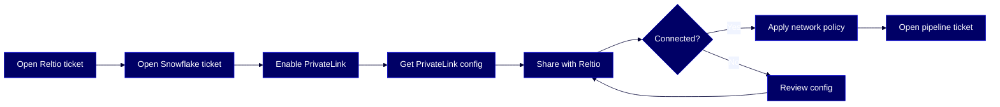

# HOWTO: Configure PrivateLink connectivity for Snowflake (Direct Connect) Data Pipeline for BCE edition

Establish a secure, private connection between your Reltio tenant and your Snowflake account on AWS using AWS PrivateLink, so that the Snowflake (Direct Connect) Data Pipeline exports data over a private channel instead of the public internet.



## Overview

This guide walks you through enabling [AWS PrivateLink](#glossary) between your Reltio tenant and your Snowflake account so that the [Snowflake (Direct Connect)](#glossary) Data Pipeline exports data over a private, secure channel. You'll coordinate between Reltio Support and Snowflake Support to establish the connection, then configure the data pipeline.

This guide is for these Reltio roles: **Data Product Owner**, **Solution Architect**, **System Administrator**. For more information on data unification roles in the Reltio Context Intelligence Platform, see [About roles](https://docs.reltio.com/en/roles/about-roles).

## Contents

1. [Getting started](#1-getting-started)
2. [Key concepts](#2-key-concepts)
3. [Check the PrivateLink support matrix](#3-check-the-privatelink-support-matrix)
4. [Open a Reltio support ticket](#4-open-a-reltio-support-ticket)
5. [Enable PrivateLink on your Snowflake account](#5-enable-privatelink-on-your-snowflake-account)
6. [Retrieve and share your Snowflake PrivateLink configuration](#6-retrieve-and-share-your-snowflake-privatelink-configuration)
7. [Apply a Snowflake network policy](#7-apply-a-snowflake-network-policy)
8. [Open a pipeline configuration ticket](#8-open-a-pipeline-configuration-ticket)
9. [Troubleshooting](#9-troubleshooting)
10. [Further reading](#10-further-reading)
11. [Glossary](#11-glossary)

## 1. Getting started

Before you begin, confirm the following are in place:

- **Reltio tenant on AWS** — your tenant must be hosted on AWS (not Azure or GCP).
- **Reltio standard edition** — PrivateLink connectivity for the Snowflake (Direct Connect) Data Pipeline isn't supported for Reltio [Business Critical Edition](#glossary) (BCE) tenants.
- **Snowflake account on AWS** — your Snowflake account must be hosted on AWS in the same region as your Reltio tenant. Cross-region PrivateLink isn't supported.
- **Snowflake [Business Critical Edition](#glossary) or higher** — lower Snowflake editions don't support PrivateLink.
- **Snowflake `ACCOUNTADMIN` role** — the user performing Snowflake configuration must have the `ACCOUNTADMIN` role.
- **Reltio Data Pipeline for Snowflake add-on** — your tenant must have this add-on enabled.
- **Access to Reltio Support** — you'll need to open support tickets during this process.
- **Access to Snowflake Support** — you'll need to open a support case in the Snowflake Support Portal.

> **Important:** The edition requirements are specific: your *Reltio* tenant must be on the standard edition, while your *Snowflake* account must be on Business Critical Edition or higher. Don't confuse these — they apply to different systems.

> **Learn more:** [Configure PrivateLink Connectivity for Snowflake (Direct Connect) Data Pipeline](https://docs.reltio.com/en/applications/data-integrations/data-pipelines-at-a-glance/reltio-data-pipeline-for-snowflake-at-a-glance/reltio-data-pipeline-for-snowflake-setup/configure-privatelink-connectivity-for-snowflake-direct-connect-data-pipeline) in the Reltio documentation.

## 2. Key concepts

**[Snowflake (Direct Connect)](#glossary)** is the recommended Reltio Data Pipeline for Snowflake architecture. It writes data from the Reltio Context Intelligence Platform directly to the Snowflake [internal stage](#glossary) over JDBC. Snowflake secures data in transit using TLS 1.2 (or higher) encryption for all JDBC connections by default.

**[AWS PrivateLink](#glossary)** adds a layer of private connectivity on top of this. Instead of routing JDBC traffic over the public internet, PrivateLink keeps it within the AWS network. This is an optional configuration — TLS encryption is already enforced on all connections, so PrivateLink is for organizations that require private connectivity as an additional security measure.

The setup is a coordinated process between three parties:

- **Reltio Support** — provisions the AWS infrastructure on the Reltio side and confirms connectivity.
- **Snowflake Support** — enables PrivateLink for your Snowflake account.
- **You** — provide the required details to both support teams and run configuration commands in Snowflake.

**[Reltio Business Critical Edition (BCE)](#glossary)** is a premium service offering with cross-region failover and enhanced security features including AWS Private Link and Reltio Shield. However, PrivateLink connectivity for the Snowflake (Direct Connect) Data Pipeline specifically requires a Reltio *standard edition* tenant — not a BCE tenant.

> **Learn more:** [Reltio Data Pipeline for Snowflake (Direct Connect) architecture](https://docs.reltio.com/en/applications/data-integrations/data-pipelines-at-a-glance/reltio-data-pipeline-for-snowflake-at-a-glance/reltio-data-pipeline-for-snowflake-direct-connect-architecture) in the Reltio documentation.

## 3. Check the PrivateLink support matrix

Before you start the setup process, verify that your specific deployment combination supports PrivateLink. The support matrix evaluates the following factors:

- **Reltio hosting cloud** — must be AWS.
- **Snowflake hosting cloud** — must be AWS.
- **Region alignment** — both must be in the same AWS region.
- **Reltio edition** — must be standard edition (not BCE).
- **Snowflake edition** — must be Business Critical Edition or higher.

If any of these conditions isn't met, PrivateLink connectivity isn't supported for your deployment. Any requirement not explicitly listed in the support matrix is also not supported.

> **Learn more:** [PrivateLink connectivity support matrix for Reltio Data Pipeline for Snowflake (Direct Connect)](https://docs.reltio.com/en/applications/data-integrations/data-pipelines-at-a-glance/reltio-data-pipeline-for-snowflake-at-a-glance/reltio-data-pipeline-for-snowflake-setup/privatelink-connectivity-support-matrix-for-reltio-data-pipeline-for-snowflake-direct-connect) in the Reltio documentation.

## 4. Open a Reltio support ticket

Open a [Reltio support ticket](https://docs.reltio.com/en/reltio/whats-in-the-box/whats-in-the-box-at-a-glance/technical-assistance-at-a-glance/technical-assistance-operations/get-help-in-support-portal) to request Snowflake Data Pipeline Private Link setup for your tenant.

Include the following information in the ticket:

- Your **tenant ID**.
- Your **Reltio environment name** (for example, `reltio-prod-us-east-1`).
- The **12-digit AWS account ID** associated with your Reltio tenant.
- The **private CIDR range** (if IP whitelisting is required).

Ask Reltio Support to provide the 12-digit AWS account ID that Snowflake will need to enable PrivateLink. Keep this ticket open — you'll return to it later.

> **Learn more:** [Get help in the Reltio Support Portal](https://docs.reltio.com/en/reltio/whats-in-the-box/whats-in-the-box-at-a-glance/technical-assistance-at-a-glance/technical-assistance-operations/get-help-in-support-portal) in the Reltio documentation.

## 5. Enable PrivateLink on your Snowflake account

Open a support case in the Snowflake Support Portal to enable AWS PrivateLink for your Snowflake account.

Include the following details in the Snowflake support case:

- Whether you plan to use **separate Snowflake accounts** for each Reltio tenant (dev, test, prod) or the **same account** for all tenants. If separate, provide the locator and region for each account.
- Your **Snowflake account locator**.
- **Cloud Provider:** AWS.
- The **AWS region** where your Snowflake account is hosted.
- A statement confirming that the account uses **Business Critical Edition**.
- The **12-digit AWS account ID** provided by Reltio.
- A request to enable AWS PrivateLink for the Snowflake account.

Wait for Snowflake to confirm that PrivateLink is enabled before proceeding to the next step.

> **Learn more:** [Configuring AWS PrivateLink](https://docs.reltio.com/en/reltio/whats-in-the-box/whats-in-the-box-at-a-glance/additional-subscriptions-at-a-glance/reltio-private-link/configuring-aws-privatelink) in the Reltio documentation.

## 6. Retrieve and share your Snowflake PrivateLink configuration

After Snowflake enables PrivateLink for your account, run the following command in your Snowflake account to retrieve the PrivateLink configuration details:

```sql
SELECT SYSTEM$GET_PRIVATELINK_CONFIG();
```

This returns a JSON object containing connection details. Capture the following values and add them to your open Reltio support ticket:

- `privatelink-vpce-id` — Snowflake's AWS VPC endpoint service ID.
- `privatelink-account-url` — the private hostname for Snowflake access.
- The **AWS region** of your Snowflake account.

Wait for Reltio to confirm successful PrivateLink connectivity before proceeding.

> **Learn more:** [Configure PrivateLink Connectivity for Snowflake (Direct Connect) Data Pipeline](https://docs.reltio.com/en/applications/data-integrations/data-pipelines-at-a-glance/reltio-data-pipeline-for-snowflake-at-a-glance/reltio-data-pipeline-for-snowflake-setup/configure-privatelink-connectivity-for-snowflake-direct-connect-data-pipeline) in the Reltio documentation.

## 7. Apply a Snowflake network policy

This step is optional. After PrivateLink connectivity is confirmed, you can apply a network policy in Snowflake to restrict public internet access to your account.

For instructions, see [CREATE NETWORK POLICY](https://docs.snowflake.com/en/sql-reference/sql/create-network-policy) in the Snowflake documentation.

> **Tip:** Applying a network policy ensures that all traffic to your Snowflake account goes through the PrivateLink connection, blocking public internet access entirely.

## 8. Open a pipeline configuration ticket

After PrivateLink connectivity is confirmed, open a second Reltio support ticket to configure the Snowflake Data Pipeline.

Include the following information:

- **Warehouse name** — the Snowflake compute warehouse used for the pipeline.
- **Database name** — the target Snowflake database.
- **Schema name** — the schema inside the database.
- **Role** — the Snowflake role with the required permissions.
- **Internal stage name** — the stage where data is loaded before processing.

After Reltio configures the pipeline, you can proceed to set up Snowflake (Direct Connect) in the Reltio Console.

> **Learn more:** [Configure Snowflake (Direct Connect) in Console](https://docs.reltio.com/en/applications/data-integrations/data-pipelines-at-a-glance/reltio-data-pipeline-for-snowflake-at-a-glance/reltio-data-pipeline-for-snowflake-setup/configure-snowflake-direct-connect-in-console) in the Reltio documentation.

## 9. Troubleshooting

These are the most common issues when setting up PrivateLink for the Snowflake (Direct Connect) Data Pipeline:

| Symptom | Cause | Fix |
|---|---|---|
| Reltio can't confirm PrivateLink connectivity | Incorrect `privatelink-vpce-id` or `privatelink-account-url` shared with Reltio | Re-run `SYSTEM$GET_PRIVATELINK_CONFIG()` in Snowflake and verify the values in your Reltio support ticket |
| PrivateLink setup rejected by Snowflake Support | Snowflake account isn't on Business Critical Edition or higher | Upgrade your Snowflake account to Business Critical Edition |
| PrivateLink not supported for your deployment | Reltio tenant or Snowflake account isn't on AWS, or they're in different regions | Verify both are on AWS and in the same region using the support matrix |
| PrivateLink not supported for BCE tenants | Reltio tenant is on Business Critical Edition | PrivateLink for Snowflake (Direct Connect) requires a Reltio standard edition tenant |
| Pipeline validation fails after PrivateLink setup | Snowflake role doesn't have required permissions | Verify the pipeline user's role has the necessary grants for the warehouse, database, schema, stage, stream, task, table, and file format objects |
| Public internet access still works after PrivateLink | No network policy applied in Snowflake | Apply a network policy to restrict access to PrivateLink only |

> **Learn more:** [Configure PrivateLink Connectivity for Snowflake (Direct Connect) Data Pipeline](https://docs.reltio.com/en/applications/data-integrations/data-pipelines-at-a-glance/reltio-data-pipeline-for-snowflake-at-a-glance/reltio-data-pipeline-for-snowflake-setup/configure-privatelink-connectivity-for-snowflake-direct-connect-data-pipeline) in the Reltio documentation.

## 10. Further reading

- [Configure PrivateLink Connectivity for Snowflake (Direct Connect) Data Pipeline](https://docs.reltio.com/en/applications/data-integrations/data-pipelines-at-a-glance/reltio-data-pipeline-for-snowflake-at-a-glance/reltio-data-pipeline-for-snowflake-setup/configure-privatelink-connectivity-for-snowflake-direct-connect-data-pipeline)
- [PrivateLink connectivity support matrix for Reltio Data Pipeline for Snowflake (Direct Connect)](https://docs.reltio.com/en/applications/data-integrations/data-pipelines-at-a-glance/reltio-data-pipeline-for-snowflake-at-a-glance/reltio-data-pipeline-for-snowflake-setup/privatelink-connectivity-support-matrix-for-reltio-data-pipeline-for-snowflake-direct-connect)
- [Configure Snowflake (Direct Connect) in Console](https://docs.reltio.com/en/applications/data-integrations/data-pipelines-at-a-glance/reltio-data-pipeline-for-snowflake-at-a-glance/reltio-data-pipeline-for-snowflake-setup/configure-snowflake-direct-connect-in-console)
- [Reltio Data Pipeline for Snowflake (Direct Connect) architecture](https://docs.reltio.com/en/applications/data-integrations/data-pipelines-at-a-glance/reltio-data-pipeline-for-snowflake-at-a-glance/reltio-data-pipeline-for-snowflake-direct-connect-architecture)
- [Reltio Data Pipeline for Snowflake at a glance](https://docs.reltio.com/en/applications/data-integrations/data-pipelines-at-a-glance/reltio-data-pipeline-for-snowflake-at-a-glance)
- [Configuring AWS PrivateLink](https://docs.reltio.com/en/reltio/whats-in-the-box/whats-in-the-box-at-a-glance/additional-subscriptions-at-a-glance/reltio-private-link/configuring-aws-privatelink)
- [Reltio Business Critical Edition](https://docs.reltio.com/en/reltio/whats-in-the-box/whats-in-the-box-at-a-glance/additional-subscriptions-at-a-glance/reltio-business-critical-edition)
- [Understanding end-to-end encryption in Snowflake](https://docs.snowflake.com/en/user-guide/security-encryption-end-to-end)

## 11. Glossary

**AWS PrivateLink:** An AWS networking feature that provides private connectivity between VPCs and services without exposing traffic to the public internet. In this context, it creates a private connection between your Reltio tenant and your Snowflake account on AWS.

**Business Critical Edition (BCE):** A premium Reltio service offering that extends standard data resilience with cross-region failover, enhanced security (AWS Private Link and Reltio Shield), and a 99.99% availability SLA. Note that Reltio BCE tenants don't support PrivateLink for the Snowflake (Direct Connect) Data Pipeline — this requires a Reltio standard edition tenant.

**Internal stage:** A Snowflake storage location within your Snowflake account where data is loaded before being processed into final tables. The Direct Connect pipeline writes directly to this stage over JDBC.

**Reltio Data Pipeline for Snowflake:** A Reltio add-on that exports mastered data from Reltio to Snowflake. It supports entities, relationships, interactions, matches, merges, and optionally activity logs and workflow data.

**Snowflake Business Critical Edition:** A Snowflake account tier that provides enhanced security features including support for AWS PrivateLink, HIPAA compliance, and customer-managed keys. Required on the Snowflake side for PrivateLink connectivity.

**Snowflake (Direct Connect):** The recommended Reltio Data Pipeline for Snowflake architecture that writes data from Reltio directly to the Snowflake internal stage over JDBC, eliminating the need for external cloud storage staging. This is the current architecture — Snowflake (Staging Pipeline) is the legacy approach.

**VPC endpoint:** An AWS networking component that enables private connections between your VPC and supported AWS services. In this setup, a VPC endpoint connects the Reltio AWS environment to your Snowflake account's PrivateLink service.

---

> **Disclaimer:** AI-generated from the Reltio documentation snapshot 2026-05-06 02:14 UTC (3,240 topics). AI output can contain subtle inaccuracies, and the knowledge base syncs twice a week — so the content here may lag [docs.reltio.com](https://docs.reltio.com). Verify anything critical against the official docs and your own tenant. Full disclaimer: [DISCLAIMER.md](../DISCLAIMER.md).
