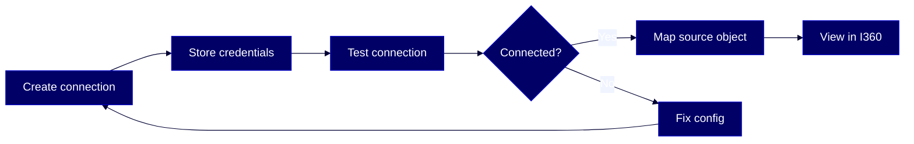

# HOWTO: Use Reltio Zero Copy Interaction Integration from Databricks

Access interaction and transaction data stored in Databricks directly from Intelligent 360 — without copying that data into Reltio.



## Overview

This guide walks you through configuring Reltio [Zero Copy Integration](#glossary) to query interaction data stored in Databricks and display it alongside mastered profiles in [Intelligent 360](#glossary). You'll create a connection, store OAuth credentials, test connectivity, and map a Databricks source object to a Reltio [interaction type](#glossary).

This guide is for these Reltio roles: **Data Product Owner**, **Data Steward**, **Solution Architect**, **System Administrator**. For more information on data unification roles in the Reltio Context Intelligence Platform, see [About roles](https://docs.reltio.com/en/roles/about-roles).

## Contents

1. [Getting started](#1-getting-started)
2. [Key concepts](#2-key-concepts)
3. [Create a Databricks connection](#3-create-a-databricks-connection)
4. [Store Databricks OAuth credentials](#4-store-databricks-oauth-credentials)
5. [Test the Databricks connection](#5-test-the-databricks-connection)
6. [Map a Databricks source object to an interaction type](#6-map-a-databricks-source-object-to-an-interaction-type)
7. [Troubleshooting](#7-troubleshooting)
8. [Further reading](#8-further-reading)
9. [Glossary](#9-glossary)

## 1. Getting started

Before you begin, confirm the following are in place:

- A Reltio role that allows you to manage data integrations, such as `ROLE_ADMIN` or `PUBLIC`.
- A running Databricks [SQL Warehouse](#glossary).
- A Databricks [service principal](#glossary) with an OAuth client ID and client secret.
- Databricks permissions that allow the service principal to access integration objects:
  - `CAN USE` on the SQL Warehouse.
  - `USE CATALOG` on the target catalog.
  - `USE SCHEMA` on the target schema.
  - `SELECT` on each target table or view.
- An existing Reltio interaction type to use in the mapping.
- The Databricks workspace URL, warehouse ID, and shared catalog name for your source data.
- `curl` (or another HTTP client like Postman) installed on your machine.
- A valid Reltio access token. Store it in a variable for reuse:

```bash
export TOKEN="YOUR_ACCESS_TOKEN"
export PLATFORM_URL="https://YOUR_PLATFORM_URL"
export TENANT_ID="YOUR_TENANT_ID"
```

> **Learn more:** [Configure Reltio Zero Copy Interaction Integration from Databricks using APIs](https://docs.reltio.com/en/applications/data-integrations/zero-copy-integration-at-a-glance/reltio-zero-copy-interaction-integration-from-databricks-at-a-glance/configure-reltio-zero-copy-interaction-integration-from-databricks-using-apis) in the Reltio documentation.

## 2. Key concepts

**[Zero Copy Integration](#glossary)** lets Reltio query external datasets — like transactions or events — without copying them into the platform. Instead of traditional ETL pipelines, Reltio sends real-time, filtered queries to the external data source and federates the results into the Intelligent 360 experience.

With the Databricks integration, Databricks remains the source for interaction and transaction data, while Reltio remains the source for mastered profile data. Reltio reads mapped Databricks tables or views on demand and links the interaction data to profiles through [crosswalk](#glossary) IDs. Entity and demographic data must already be loaded into Reltio so that Reltio can perform identity resolution and maintain mastered profiles.

This integration enables you to:

- Leverage interaction and transaction datasets in Databricks without replication.
- Link Databricks datasets to Reltio profiles through crosswalk IDs.

The architecture connects Reltio to Databricks through a configured connection, an [interaction mapping](#glossary), and OAuth 2.0 machine-to-machine authentication with a Databricks service principal. Reltio accesses only the Databricks SQL Warehouse and [Unity Catalog](#glossary) objects that the configured service principal is allowed to use — Databricks continues to control access to the external interaction data.

> **Important:** This integration uses OAuth 2.0 machine-to-machine authentication. Reltio authenticates to Databricks using a service principal instead of a user sign-in. Personal Access Tokens aren't supported.

> **Learn more:** [Reltio Zero Copy Interaction Integration from Databricks at a glance](https://docs.reltio.com/en/applications/data-integrations/zero-copy-integration-at-a-glance/reltio-zero-copy-interaction-integration-from-databricks-at-a-glance) in the Reltio documentation.

## 3. Create a Databricks connection

`POST /reltio/api/tenants/{tenantId}/interactions/database-configs/`

Create a named Databricks connection configuration in Reltio. The connection defines the Databricks workspace, SQL Warehouse, shared catalog, connection properties, and authentication type. When the request succeeds, Reltio saves the configuration and returns a generated `connectionId`.

**Request**

```bash
curl -s -X POST "${PLATFORM_URL}/reltio/api/tenants/${TENANT_ID}/interactions/database-configs/" \
  -H "Authorization: Bearer ${TOKEN}" \
  -H "Content-Type: application/json" \
  -d '{
    "connection_name": "my-databricks-connection",
    "database_type": "DATABRICKS",
    "databricks_config": {
      "workspace": {
        "workspace_url": "https://adb-1234567890123456.7.azuredatabricks.net",
        "workspace_id": "1234567890123456",
        "region": "us-east-1",
        "cloud_provider": "AWS"
      },
      "sql_warehouse": {
        "warehouse_id": "abc123def456",
        "warehouse_name": "my-warehouse",
        "size": "SMALL",
        "auto_stop": true,
        "auto_stop_minutes": 10
      },
      "share_info": {
        "shared_catalog_name": "reltio_interactions"
      },
      "connection_properties": {
        "query_timeout": 300,
        "max_pool_size": 5
      },
      "auth_type": "OAUTH_M2M"
    }
  }' | jq .
```

The following table describes the required request body parameters:

| Parameter | Type | Description |
|---|---|---|
| `connection_name` | String | Unique name for the Databricks connection within the tenant |
| `database_type` | String | Must be `DATABRICKS` |
| `databricks_config.workspace.workspace_url` | String | Full HTTPS URL of the Databricks workspace |
| `databricks_config.sql_warehouse.warehouse_id` | String | Databricks SQL Warehouse identifier |
| `databricks_config.share_info.shared_catalog_name` | String | Unity Catalog name that Reltio uses for mapped tables or views |
| `databricks_config.auth_type` | String | Must be `OAUTH_M2M` |

> **Note:** This endpoint accepts additional optional parameters such as `workspace_id`, `region`, `cloud_provider`, `warehouse_name`, `size`, `auto_stop`, `auto_stop_minutes`, `query_timeout`, and `max_pool_size`. See the [official documentation](https://docs.reltio.com/en/applications/data-integrations/zero-copy-integration-at-a-glance/reltio-zero-copy-interaction-integration-from-databricks-at-a-glance/create-a-databricks-connection-configuration) for the full parameter reference.

**Response**

If the request succeeds, Reltio returns HTTP `201 Created` with the saved connection configuration, including the generated `connectionId`:

```json
{
    "successful": true,
    "result": {
        "connection_id": "e1fc522f-8380-4177-98b9-acd63767d73b",
        "connection_name": "my-databricks-connection",
        "tenant_id": "YOUR_TENANT_ID",
        "database_type": "DATABRICKS",
        "databricks_config": {
            "workspace": {
                "workspace_url": "https://adb-1234567890123456.7.azuredatabricks.net",
                "workspace_id": "1234567890123456",
                "region": "us-east-1",
                "cloud_provider": "AWS"
            },
            "share_info": {
                "shared_catalog_name": "reltio_interactions"
            },
            "sql_warehouse": {
                "warehouse_id": "abc123def456",
                "size": "SMALL",
                "auto_stop": true,
                "auto_stop_minutes": 10
            },
            "connection_properties": {
                "queryTimeout": 120000,
                "maxPoolSize": 5
            },
            "auth_type": "OAUTH_M2M"
        },
        "status": "PENDING",
        ...
    }
}
```

Save the `connection_name` value — you'll need it for the next steps.

### Key rules

- **Connection names are unique per tenant** — if you reuse a name that already exists, the API returns `400 Bad Request`.
- **`auth_type` must be `OAUTH_M2M`** — this is the only supported authentication type for Databricks connections.
- **`database_type` must be `DATABRICKS`** — this distinguishes it from Snowflake-based Zero Copy connections.

### What can go wrong

| Error | Cause | Fix |
|---|---|---|
| `400 Bad Request` — connection name already exists | A connection with the same name is already defined for this tenant | Choose a different `connection_name` |
| `401 Unauthorized` | Expired or invalid Reltio access token | Re-authenticate and get a new token |

> **Learn more:** [Create a Databricks connection configuration](https://docs.reltio.com/en/applications/data-integrations/zero-copy-integration-at-a-glance/reltio-zero-copy-interaction-integration-from-databricks-at-a-glance/create-a-databricks-connection-configuration) in the Reltio documentation.

## 4. Store Databricks OAuth credentials

`POST /reltio/api/tenants/{tenantId}/interactions/database-configs/{connectionName}/databricks/oauth/credentials`

Store the Databricks service principal client ID and client secret in Reltio. Reltio uses these credentials to request and refresh Databricks access tokens automatically. This operation doesn't require a public key or a SQL statement in Databricks.

**Request**

```bash
curl -s -X POST "${PLATFORM_URL}/reltio/api/tenants/${TENANT_ID}/interactions/database-configs/my-databricks-connection/databricks/oauth/credentials" \
  -H "Authorization: Bearer ${TOKEN}" \
  -H "Content-Type: application/json" \
  -d '{
    "clientId": "YOUR_DATABRICKS_CLIENT_ID",
    "clientSecret": "YOUR_DATABRICKS_CLIENT_SECRET"
  }' | jq .
```

Replace `my-databricks-connection` with the `connection_name` you used in the previous step.

The following table describes the request body parameters:

| Parameter | Type | Required | Description |
|---|---|---|---|
| `clientId` | String | Yes | OAuth client ID of the Databricks service principal |
| `clientSecret` | String | Yes | OAuth client secret of the Databricks service principal |

**Response**

```json
{
  "status": "success",
  "data": {
    "status": "success",
    "message": "Databricks M2M OAuth credentials stored successfully",
    "connectionId": "e1fc522f-8380-4177-98b9-acd63767d73b",
    "connectionName": "my-databricks-connection",
    "timestamp": 1743600000000
  }
}
```

### Key rules

- **Both `clientId` and `clientSecret` are required** — omitting either returns a `400 Bad Request` error.
- **Credentials are stored per connection** — each Databricks connection has its own set of OAuth credentials.

### What can go wrong

| Error | Cause | Fix |
|---|---|---|
| `DS_DATABRICKS_OAUTH_CLIENT_ID_REQUIRED` | The `clientId` field is null or empty | Provide a valid service principal client ID |
| `DS_DATABRICKS_OAUTH_CLIENT_SECRET_REQUIRED` | The `clientSecret` field is null or empty | Provide a valid service principal client secret |
| `401 Unauthorized` | Expired or invalid Reltio access token | Re-authenticate and get a new token |

> **Learn more:** [Store Databricks OAuth credentials](https://docs.reltio.com/en/applications/data-integrations/zero-copy-integration-at-a-glance/reltio-zero-copy-interaction-integration-from-databricks-at-a-glance/store-databricks-oauth-credentials) in the Reltio documentation.

## 5. Test the Databricks connection

`POST /reltio/api/tenants/{tenantId}/interactions/database-configs/{connectionName}/test`

Verify that Reltio can connect to the Databricks SQL Warehouse using the stored OAuth credentials. Always test before creating the interaction mapping.

**Request**

```bash
curl -s -X POST "${PLATFORM_URL}/reltio/api/tenants/${TENANT_ID}/interactions/database-configs/my-databricks-connection/test" \
  -H "Authorization: Bearer ${TOKEN}" \
  -H "Content-Type: application/json" | jq .
```

This operation doesn't require a request body.

**Response**

If the connection test succeeds:

```json
{
  "status": "success",
  "data": {
    "connected": true,
    "databaseType": "DATABRICKS",
    "message": "Connection successful"
  }
}
```

If the connection test fails:

```json
{
  "status": "success",
  "data": {
    "connected": false,
    "databaseType": "DATABRICKS",
    "message": "Connection failed: Unable to connect to SQL Warehouse"
  }
}
```

### Key rules

- **This endpoint always returns HTTP `200 OK`** — even when the connection fails. Check the `data.connected` field to determine the actual result.
- **Test before mapping** — if the connection isn't valid, the mapping step won't work.

### What can go wrong

| Error | Cause | Fix |
|---|---|---|
| `connected: false` — unable to connect to SQL Warehouse | Incorrect warehouse ID, workspace URL, or service principal permissions | Verify the workspace URL and warehouse ID in your connection config. Confirm the service principal has `CAN USE` on the SQL Warehouse |
| `connected: false` — OAuth authentication failed | Invalid or expired service principal credentials | Re-store the credentials using the Store Databricks OAuth credentials API |
| `401 Unauthorized` | Expired or invalid Reltio access token | Re-authenticate and get a new token |

> **Learn more:** [Test a Databricks connection](https://docs.reltio.com/en/applications/data-integrations/zero-copy-integration-at-a-glance/reltio-zero-copy-interaction-integration-from-databricks-at-a-glance/test-a-databricks-connection) in the Reltio documentation.

## 6. Map a Databricks source object to an interaction type

`PUT /reltio/api/tenants/{tenantId}/zero-copy-interactions/mappings/{connectionId}`

Define which Databricks table or view Reltio queries, which columns come back as interaction attributes, and how Databricks rows link to Reltio entities through crosswalk IDs.

**Request**

```bash
curl -s -X PUT "${PLATFORM_URL}/reltio/api/tenants/${TENANT_ID}/zero-copy-interactions/mappings/e1fc522f-8380-4177-98b9-acd63767d73b" \
  -H "Authorization: Bearer ${TOKEN}" \
  -H "Content-Type: application/json" \
  -d '{
    "interaction_id": "customer_purchases_v1",
    "interaction_type": "CustomerPurchase",
    "table_name": "reltio_interactions.customer_data.purchases",
    "timestamp_column": "purchase_timestamp",
    "order_by_column": "purchase_timestamp",
    "attributes": [
      { "attribute_display_name": "Amount", "column_name": "amount", "data_type": "Decimal" },
      { "attribute_display_name": "Channel", "column_name": "channel", "data_type": "String" },
      { "attribute_display_name": "Product", "column_name": "product", "data_type": "String" }
    ],
    "member_mappings": [
      { "member_type": "Individual", "column_name": "customer_crosswalk_id" },
      { "member_type": "Organization", "column_name": "org_crosswalk_id" }
    ]
  }' | jq .
```

Replace the `connectionId` in the URL path with the value returned from step 3.

The following table describes the required request body parameters:

| Parameter | Type | Description |
|---|---|---|
| `interaction_id` | String | Unique identifier for this interaction mapping |
| `interaction_type` | String | Name of an existing Reltio interaction type |
| `table_name` | String | Fully qualified Databricks source object in `catalog.schema.table` format |
| `timestamp_column` | String | Source column used as the interaction timestamp |
| `order_by_column` | String | Source column used to sort returned rows |
| `attributes` | Array | Databricks columns returned as interaction attributes — each with `attribute_display_name`, `column_name`, and `data_type` |
| `member_mappings` | Array | Links Reltio entity types to Databricks columns that contain crosswalk IDs — each with `member_type` and `column_name` |

**Response**

If the request succeeds, Reltio returns HTTP `200 OK` with the saved mapping:

```json
{
  "successful": true,
  "result": [
    {
      "interaction_id": "d444c359-438f-497a-b1a4-ee76d3f82914",
      "interaction_type": "CustomerPurchase",
      "table_name": "purchases",
      "database_name": "reltio_interactions",
      "schema_name": "customer_data",
      "order_by_column": "purchase_timestamp",
      "attributes": [
        { "attribute_name": "Amount", "column_name": "amount" },
        { "attribute_name": "Channel", "column_name": "channel" },
        { "attribute_name": "Product", "column_name": "product" }
      ],
      "member_mappings": [
        { "member_type": "Individual", "column_name": "customer_crosswalk_id" },
        { "member_type": "Organization", "column_name": "org_crosswalk_id" }
      ],
      "created_time": "2026-04-02T10:17:07.609044726",
      "updated_time": "2026-04-02T10:17:07.609044726",
      "deleted": false,
      "timestamp_column": "purchase_timestamp"
    }
  ]
}
```

After this step, Reltio can query the mapped Databricks source and return matching interaction data for related profiles in Intelligent 360 — without copying that data into Reltio.

### Key rules

- **The `table_name` uses the Unity Catalog three-part name** — `catalog.schema.table`. This lets Reltio identify the mapped object in the Databricks catalog structure.
- **The `interaction_type` must already exist** in your Reltio tenant configuration. If it doesn't, the API returns a validation error.
- **Each `member_mappings` entry links one entity type** — the `column_name` must contain crosswalk IDs that match the crosswalks on your Reltio entities.
- **Attribute names in the mapping must match** the attributes configured on the interaction type in Reltio.

### What can go wrong

| Error | Cause | Fix |
|---|---|---|
| `400 Bad Request` — attribute not configured for interaction type | An attribute name in your mapping doesn't match the Reltio interaction type configuration | Check the attribute names configured on your interaction type and correct the mapping |
| `400 Bad Request` — type is not found | The interaction type doesn't exist in the tenant | Create the interaction type in your Reltio tenant configuration first |
| `401 Unauthorized` | Expired or invalid Reltio access token | Re-authenticate and get a new token |

> **Learn more:** [Map a Databricks source object to a Reltio interaction type](https://docs.reltio.com/en/applications/data-integrations/zero-copy-integration-at-a-glance/reltio-zero-copy-interaction-integration-from-databricks-at-a-glance/map-a-databricks-source-object-to-a-reltio-interaction-type) in the Reltio documentation.

## 7. Troubleshooting

These are the most common issues when setting up Zero Copy Interaction Integration from Databricks:

| Symptom | Cause | Fix |
|---|---|---|
| Connection test returns `connected: false` | Incorrect workspace URL, warehouse ID, or insufficient service principal permissions | Verify `workspace_url` and `warehouse_id` in the connection config. Confirm the service principal has `CAN USE` on the SQL Warehouse, `USE CATALOG`, `USE SCHEMA`, and `SELECT` on the target objects |
| OAuth credential storage fails | Missing or empty `clientId` or `clientSecret` | Provide both the service principal client ID and client secret |
| Mapping fails with "attribute not configured" | Attribute name in the mapping doesn't match the Reltio interaction type | Verify attribute names match exactly between the mapping and the interaction type configuration |
| Mapping fails with "type is not found" | The specified interaction type doesn't exist in the tenant | Create the interaction type in your Reltio tenant before creating the mapping |
| Connection name already exists error | A connection with the same name is already defined for this tenant | Choose a unique `connection_name` or update the existing connection |
| Interaction data doesn't appear in Intelligent 360 | Crosswalk IDs in Databricks don't match crosswalks on Reltio entities | Verify that the crosswalk column in your Databricks table contains values that match existing crosswalk IDs on your Reltio entities |

> **Learn more:** [Reltio Zero Copy Interaction Integration from Databricks architecture](https://docs.reltio.com/en/applications/data-integrations/zero-copy-integration-at-a-glance/reltio-zero-copy-interaction-integration-from-databricks-at-a-glance/reltio-zero-copy-interaction-integration-from-databricks-architecture) in the Reltio documentation.

## 8. Further reading

- [Zero Copy Integration at a glance](https://docs.reltio.com/en/applications/data-integrations/zero-copy-integration-at-a-glance)
- [Reltio Zero Copy Interaction Integration from Databricks at a glance](https://docs.reltio.com/en/applications/data-integrations/zero-copy-integration-at-a-glance/reltio-zero-copy-interaction-integration-from-databricks-at-a-glance)
- [Reltio Zero Copy Interaction Integration from Databricks architecture](https://docs.reltio.com/en/applications/data-integrations/zero-copy-integration-at-a-glance/reltio-zero-copy-interaction-integration-from-databricks-at-a-glance/reltio-zero-copy-interaction-integration-from-databricks-architecture)
- [Configure Reltio Zero Copy Interaction Integration from Databricks using APIs](https://docs.reltio.com/en/applications/data-integrations/zero-copy-integration-at-a-glance/reltio-zero-copy-interaction-integration-from-databricks-at-a-glance/configure-reltio-zero-copy-interaction-integration-from-databricks-using-apis)
- [Create a Databricks connection configuration](https://docs.reltio.com/en/applications/data-integrations/zero-copy-integration-at-a-glance/reltio-zero-copy-interaction-integration-from-databricks-at-a-glance/create-a-databricks-connection-configuration)
- [Store Databricks OAuth credentials](https://docs.reltio.com/en/applications/data-integrations/zero-copy-integration-at-a-glance/reltio-zero-copy-interaction-integration-from-databricks-at-a-glance/store-databricks-oauth-credentials)
- [Test a Databricks connection](https://docs.reltio.com/en/applications/data-integrations/zero-copy-integration-at-a-glance/reltio-zero-copy-interaction-integration-from-databricks-at-a-glance/test-a-databricks-connection)
- [Map a Databricks source object to a Reltio interaction type](https://docs.reltio.com/en/applications/data-integrations/zero-copy-integration-at-a-glance/reltio-zero-copy-interaction-integration-from-databricks-at-a-glance/map-a-databricks-source-object-to-a-reltio-interaction-type)

## 9. Glossary

**Crosswalk:** A reference that links a Reltio entity back to its record in a source system. Each crosswalk includes a source name and a source-system identifier. In Zero Copy Integration, crosswalk IDs in Databricks columns are used to associate interaction rows with the correct Reltio entity.

**Intelligent 360:** The Reltio experience that presents a unified view of mastered profile data alongside related interactions, relationships, and external data. Zero Copy Integration makes Databricks interaction data available in this view.

**Interaction mapping:** A configuration that defines which Databricks source object Reltio queries, which columns are returned as interaction attributes, and how Databricks rows are linked to Reltio entities through crosswalk IDs.

**Interaction type:** A classification in the Reltio data model that represents a category of interaction or transaction, such as a purchase, a support call, or a claim. The interaction type must exist in the Reltio tenant configuration before you can create a Zero Copy mapping.

**Service principal:** A Databricks identity used for machine-to-machine authentication. Instead of a user sign-in, Reltio authenticates to Databricks using the service principal's OAuth client ID and client secret.

**SQL Warehouse:** A Databricks compute resource that executes SQL queries. Reltio sends filtered queries to the SQL Warehouse when retrieving interaction data for a profile.

**Unity Catalog:** The Databricks governance layer that organizes data into catalogs, schemas, and tables. Databricks source objects are referenced using the three-part name format: `catalog.schema.table`.

**Zero Copy Integration:** A Reltio capability that lets the platform query external datasets — such as interactions or transactions — without copying them into Reltio. Reltio sends real-time, filtered queries to the external source and federates the results into Intelligent 360.

---

> **Disclaimer:** AI-generated from the Reltio documentation snapshot 2026-05-06 02:14 UTC (3,240 topics). AI output can contain subtle inaccuracies, and the knowledge base syncs twice a week — so the content here may lag [docs.reltio.com](https://docs.reltio.com). Verify anything critical against the official docs and your own tenant. Full disclaimer: [DISCLAIMER.md](../DISCLAIMER.md).
